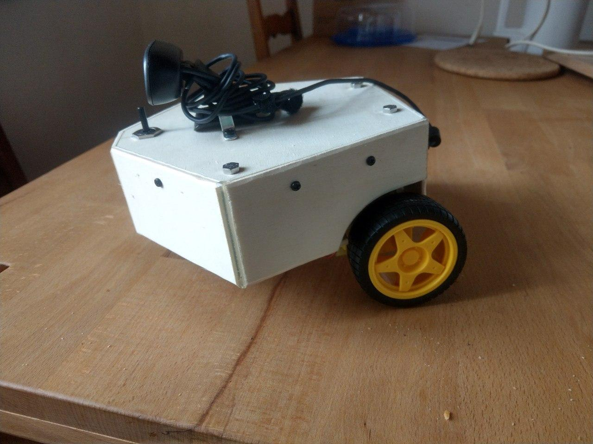

Projet

Ce projet contient une application graphique développée en java et un serveur C à installer sur un RaspberryPi. La combinaison des deux permet de controller un robot à roues depuis un client java. 

Ce projet a été fait dans le contexte du cours PRO de l'HEIG par 5 étudiants.

Pour plus d'informations sur les différentes parties du projet, se réferrer au [readme du serveur](Server/README.md) et au [readme du client](Client/README.md)